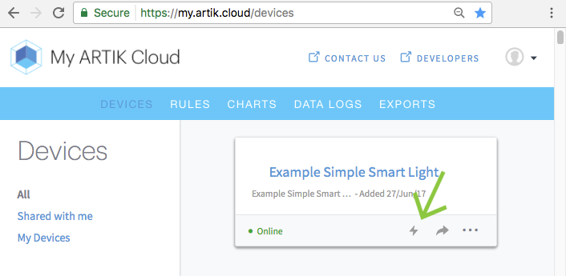
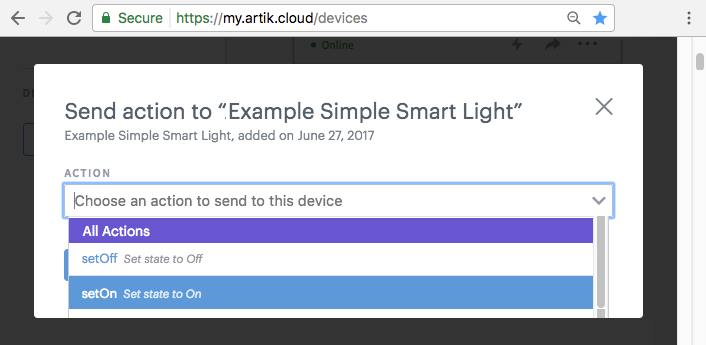
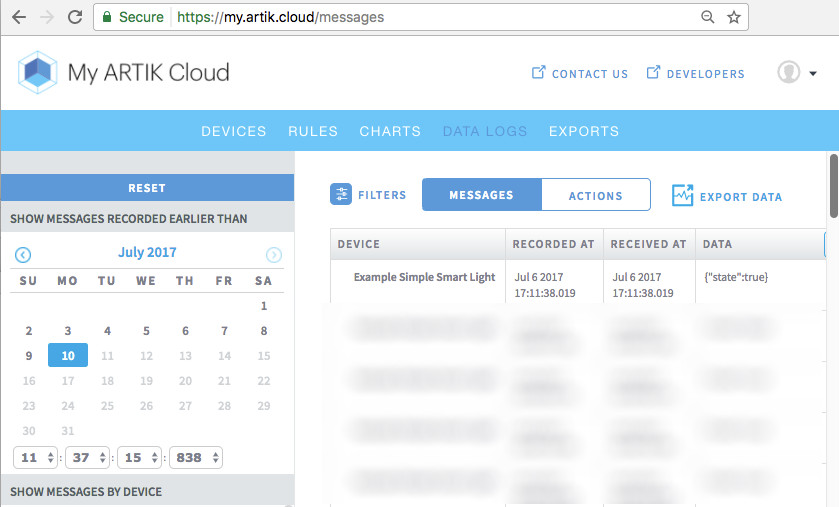

# Tutorial Nodejs device channel WebSocket

This starter code emulates a smart light connecting to ARTIK Cloud [device channel WebSocket](https://developer.artik.cloud/documentation/data-management/rest-and-websockets.html#device-channel-websocket) (/websocket). You will learn how to

- connect to the device channel WebSocket
- receive Actions from ARTIK Cloud via the channel
- send data messages to ARTIK Cloud via the channel

Consult [Node.js Firehose WebSocket](https://github.com/artikcloud/tutorial-nodejs-WebSocketFirehose) for how to use Firehose WebSocket.

Consult [An IoT remote control](https://developer.artik.cloud/documentation/tutorials/an-iot-remote-control.html#an-iot-remote-control) for how to build a real smart light using Raspberry Pi.

## Requirements

- [node](https://nodejs.org/en/download/)  (Version >= 6.5.0)
- [npm](https://www.npmjs.com/get-npm) (Version >= 3.10.0)

## Setup

### Setup at ARTIK Cloud

- Go to the Devices Dashboard (https://my.artik.cloud) and [add a new device](https://developer.artik.cloud/documentation/tools/web-tools.html#connecting-a-device):

  ```
  Device Type Name: Example Simple Smart Light
  Unique Name: cloud.artik.example.simple_smartlight
  ```

- Get the Device ID and Device Token for your newly created device in the [Device Info](https://developer.artik.cloud/documentation/tools/web-tools.html#managing-a-device-token) screen.


### Setup Project

Before running the sample, fill in the following into your the `config.json` file:

```json
{
    "deviceID": "Your-Device-Id",
    "deviceToken": "Your-Device-Token"
}
```

**Install dependencies**

 ```bash
$ npm install
 ```

##### Run Project

```bash
$ node smart-light.js
```

## Demo:

1. Your terminal screen will look similar to below after you run your project.   A WebSocket connection is open and will output actions sent to the device.

```bash
$ node smart-light.js 

Connecting to:  wss://api.artik.cloud/v1.1/websocket?ack=true
WebSocket connection is open ...
```

2. A registration message is sent to complete authentication and register devices.   This must be done within 30 seconds, otherwise connection will timeout.

```bash
Sending register message payload: 

{"type":"register","sdid":"a9abc...","authorization":"bearer 712ee...","cid":1499385659015}
```

3. Send an action ("setOn" or "setOff") to your Example Simple Smart Light.  We will send a `setOn` action using the tool available in the Devices Dashboard.
   - Send an action by clicking on the Thunder Bolt Icon
      
   - Select and send the "setOn" action
      
4. Go back to your running sample application.  You will see it has received a message of type "action.   It also contain an entry with the action "setOn".

```bash
Received message: 
{"type":"action","cts":1499386297852,"ts":1499386297852,"mid":"5c0fdb74c2814d529f9362c4aafa65b0","sdid":"a9abc...","ddid":"a9abc...","data":{"actions":[{"name":"setOn"}]},"ddtid":"dtd1d3e0934d9348b783166938c0380128","uid":"1ae12...","boid":"b0abc...","mv":1}
```

5. Upon receiving the action the sample code will send a message to ARTIK Cloud to reflect its new state.   Here we are sending the state to true when it receives a "setOn" action.


```bash
Send message and update field: 
{"sdid":"a9abc...","data":{"state":true},"cid":1499386297324}
Received message: {"data":{"mid":"057a3c0c273f4cfa8d4fadc78928f325","cid":"1499386297324"}}
```

6. View “DATA LOGS” (messages) at [My ARTIK Cloud](https://my.artik.cloud), you should see the message with state to true is received by ARTIK Cloud.  




## More about ARTIK Cloud

If you are not familiar with ARTIK Cloud, we have extensive documentation at [https://developer.artik.cloud/documentation](https://developer.artik.cloud/documentation)

The full ARTIK Cloud API specification can be found at [https://developer.artik.cloud/documentation/api-spec.html](https://developer.artik.cloud/documentation/api-spec.html)

Peek into advanced sample applications at [https://developer.artik.cloud/documentation/samples/](https://developer.artik.cloud/documentation/samples/)

To create and manage your services and devices on ARTIK Cloud, visit the Developer Dashboard at [https://developer.artik.cloud](https://developer.artik.cloud/)

## License and Copyright

Licensed under the Apache License. See [LICENSE](./LICENSE).

Copyright (c) 2017 Samsung Electronics Co., Ltd.
